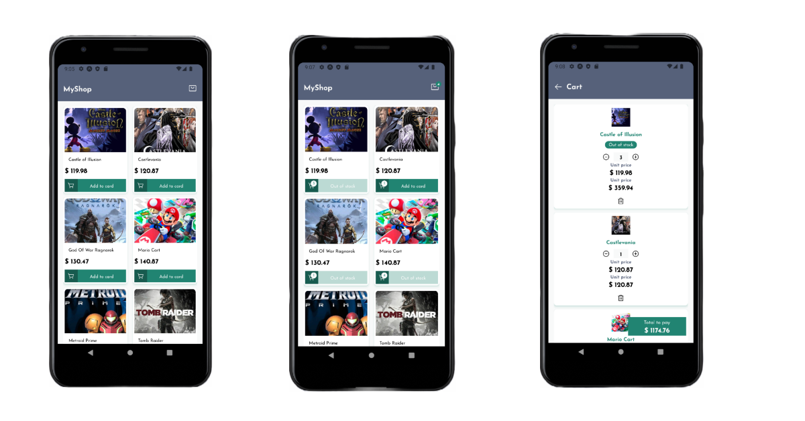

# App React Native Redux games

<p>
    
  <a href="https://opensource.org/licenses/MIT">
    
  </a>
</p>

<p align="center">  
   
</p>

# Como iniciar ?

- Clone app e abra a pasta com terminal

```bash
  git clone https://github.com/augustojaml/Redux-Games.git
```
- Opção mudar para o ip nos arquivos `src/_global/libs/api.ts` e em script server do arquivo `package.json` para o ip da da sua máquina.

- Inicie json-server

```bash
  yarn server
```

- Abra um novo terminal

```bash
  yarn start
```


## Tópicos

[Sobre o Redux Games](#sobre-o-reduxGames)

[Tecnologias](#dark-Mode-desktop)

[Tecnologias](#light-Mode-desktop)

[Tecnologias](#tecnologias)

[Licença](#licença)

[Licença](#augusto-monteiro)

<br>

## Sobre o Reduxgames

O App Redux é um App que criado com a finalidade de gerenciar estados com Redux. Também foi usado ContextApi para gerenciamento de estados dos temas.
<br>

## Dark Mode Desktop

<p align="center">  
   
</p>

## Tecnologias

Tecnologias e ferramentas utilizadas no desenvolvimento do projeto:

- [@reduxjs/toolkit](https://redux-toolkit.js.org/)
- [TypeScript](https://www.typescriptlang.org/)
- [axios](https://github.com/axios/axios)
- [styled-component](https://styled-components.com/)
- [polished](https://polished.js.org/)
- [json-server](https://github.com/typicode/json-server)

- [react-icons](https://react-icons.github.io/react-icons/)
- [react-loading](https://github.com/fakiolinho/react-loading)
- [VS Code](https://code.visualstudio.com/)

## Licença

<a href="https://opensource.org/licenses/MIT">
    
</a>

<br>

Esse projeto está sob a licença MIT. Veja o arquivo [LICENSE](/LICENSE) para mais detalhes.

---

# Augusto Monteiro

Feito com carinho :purple_heart: by [Augusto Monteiro](https://github.com/augustojaml)

[](https://www.linkedin.com/in/augustojaml)
[](mailto:jamonteirolima@gmail.com)
